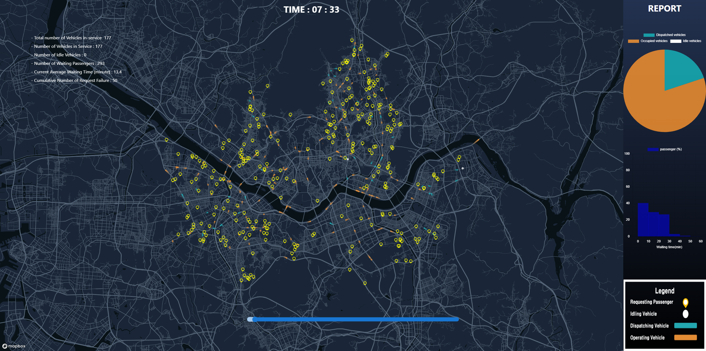

# DTUMOS-Disabled CallTaxi

[DTUMOS](https://github.com/HNU209/DTUMOS) is a digital twin framework for urban mobility operating systems. It is an open-source framework that can easily and flexibly apply to any city and mobility system worldwide. The proposed DTUMOS has distinct strengths in scalability, speed, and visualization compared to the existing state-of-the-art mobility digital twins.  We verified the performance of DTUMOS quantitatively using real-world data. DTUMOS can be utilized to develop various operation algorithms in mobility systems, including re-balancing empty vehicles, advanced dispatch, and ride-sharing algorithms, dynamic pricing, and fleet size controls. A lightweight and open-source environment is particularly advantageous when iterative learning is required, such as reinforcement learning. Furthermore, DTUMOS can also be exploited to provide quantitative evaluations and guidelines for policies and plans.



## How to use DTUMOS-Disabled CallTaxi

### Prerequisites

- Available on Linux
- Use WSL2 for Window users
- [osrm-backend](https://github.com/Project-OSRM/osrm-backend)
- Python version >= 3.8

### Getting Started
1. Clone DTUMOS-Disabled-CallTaxi
    ```
    git clone https://github.com/HNU209/DTUMOS-Disabled-CallTaxi.git
    ```
3. Run main.ipynb

## Implementation of DTUMOS-Disabled CallTaxi
### [visualization](https://hnu209.github.io/DTUMOS-Disabled-CallTaxi_simulation/) | [report](https://hnu209.github.io/DTUMOS-Disabled-CallTaxi_report/)
