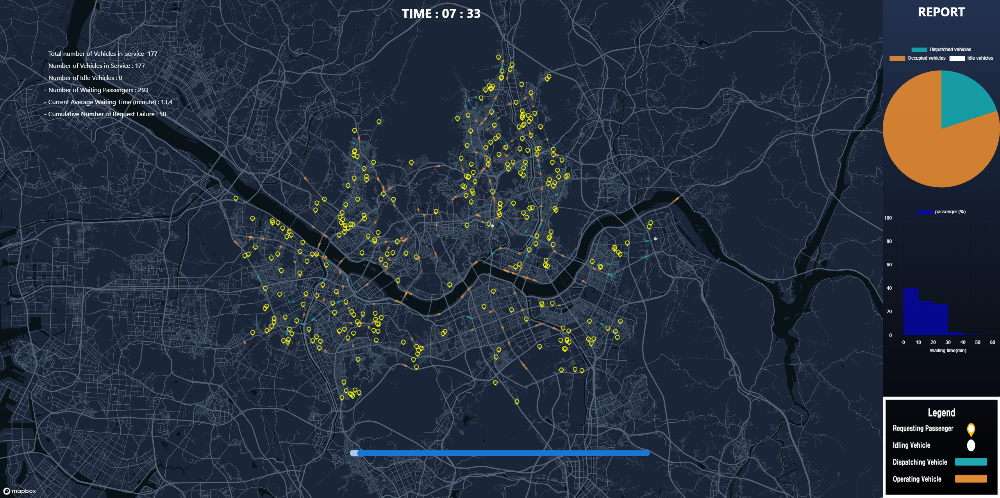

# DTUMOS-Paratransit

DTUMOS-Paratransit is an agent-based simulation framework for Seoul's wheelchair-accessible taxi service, built on [DTUMOS](https://github.com/HNU209/DTUMOS). It reproduces the operator's dispatch protocol, vehicle shift schedules, wheelchair boarding and alighting times, and demand patterns derived from trip records, and is validated against the operator's 2023–2024 operating data. The framework evaluates policy alternatives — fleet expansion, dispatch optimization, targeted staffing, and demand redirection — on identical demand realizations, so that differences between scenarios reflect the policies themselves rather than demand noise.



## How to use DTUMOS-Paratransit

### Prerequisites

- Available on Linux
- Use WSL2 for Window users
- [osrm-backend](https://github.com/Project-OSRM/osrm-backend)
- Python version >= 3.8

### Getting Started
1. Clone DTUMOS-Paratransit
    ```
    git clone https://github.com/camuslab/dtumos-paratransit.git
    ```
3. Run main.ipynb

## Implementation of DTUMOS-Paratransit
### [VISUALIZATION](https://camuslab.github.io/dtumos-paratransit-simulation/) | [REPORT](https://camuslab.github.io/dtumos-paratransit-report/)

## Data Availability

The raw paratransit trip records, agent-level simulation inputs, and per-run
simulation outputs used in this project contain sensitive mobility information
about individuals with disabilities and are therefore **not distributed** in
this repository. Only the simulation framework code, analysis scripts, and
aggregate scenario results are public. Requests for data access should be
directed to the corresponding author.
